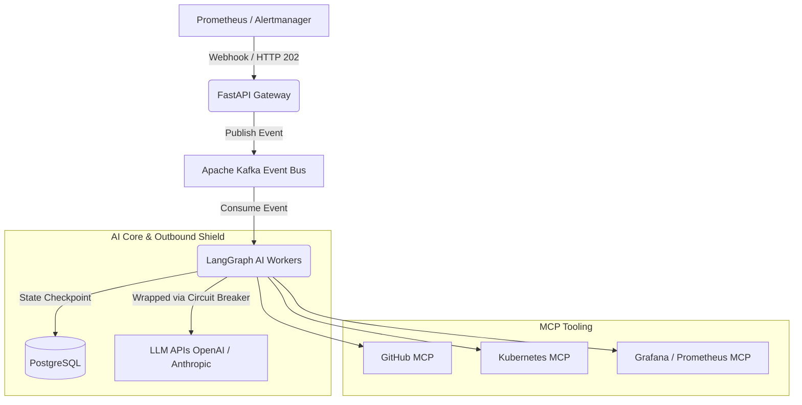

# AutoResolve

**Autonomous Incident Response & Remediation Engine**

## Table of Contents

- [1. Project Overview](#1-project-overview)
- [2. Features](#2-features)
- [3. Architecture Overview](#3-architecture-overview)
- [4. Repository Structure](#4-repository-structure)
- [5. Technology Stack](#5-technology-stack)
- [6. Prerequisites](#6-prerequisites)
- [7. Installation Guide](#7-installation-guide)
- [8. Configuration Guide](#8-configuration-guide)
- [9. Production Engineering Lab (k3d)](#9-production-engineering-lab-k3d)
- [10. Running the Project Locally](#10-running-the-project-locally)
- [11. Workflow Guide (Unified SRE Console)](#11-workflow-guide-unified-sre-console)
- [12. AI Agent Guide](#12-ai-agent-guide)
- [13. MCP Guide](#13-mcp-guide)
- [14. RAG Pipeline](#14-rag-pipeline)
- [15. Security](#15-security)
- [16. Observability](#16-observability)
- [17. Testing Guide](#17-testing-guide)
- [18. Development Workflow](#18-development-workflow)
- [19. Documentation Index](#19-documentation-index)
- [20. Troubleshooting](#20-troubleshooting)
- [21. Performance & Scalability](#21-performance--scalability)
- [22. Contributing](#22-contributing)
- [23. Roadmap](#23-roadmap)
- [24. License](#24-license)

## 1. Project Overview

AutoResolve is an enterprise-grade autonomous incident response system designed to process production alerts from monitoring tools like Prometheus. Built with advanced AI-augmented engineering principles, AutoResolve orchestrates multiple AI agents to investigate outages, determine root causes, and autonomously execute remediations.

The repository is structured and maintained to the engineering standards expected within Tier-1 technology organizations. The architecture emphasizes production readiness, high availability, and autonomous Software Development Life Cycle (SDLC) capabilities.

## 2. Features

- **Multi-Agent AI Orchestration** — Multiple specialized AI agents collaborate using LangGraph to process and resolve incidents.
- **Model Context Protocol (MCP) Integration** — Autonomously gathers logs, metrics, and traces securely through MCP.
- **Asynchronous Alert Ingestion** — A robust FastAPI gateway instantly absorbs Prometheus alerts and queues them via an Apache Kafka event bus for processing.
- **Automated Code & Infrastructure Fixes** — Agents can optionally generate infrastructure or code fixes and automatically create GitHub Pull Requests.
- **Enterprise Resilience & Circuit Breakers** — Protects system resources during external LLM outages using a dynamic Circuit Breaker pattern (`prod_resilience.py`) that instantly fails fast.
- **High Availability & Health Management** — Features a dedicated `SystemHealthManager` with a `/health/ready` Kubernetes endpoint to monitor PostgreSQL and MCP server health.
- **Stateful Disaster Recovery** — Every LangGraph node execution is checkpointed to an external PostgreSQL database, allowing investigations to resume exactly where they left off if a pod crashes.
- **Integrated Communications** — Automatically notifies engineering teams via Slack and generates comprehensive incident reports.

## 3. Architecture Overview

AutoResolve relies on a heavily decoupled Clean Architecture pattern, isolating the HTTP transport layer from business logic and AI orchestration.



### Inbound Shield

The FastAPI layer refuses traffic and signals Kubernetes if internal dependencies become unavailable.

### Outbound Shield

The LangGraph LLM wrapper refuses outbound requests if external API providers experience severe degradation.

## 4. Repository Structure

The codebase is organized following Domain-Driven Design (DDD) and Clean Architecture principles.

| Directory | Description |
| --- | --- |
| `src/api/` | Strictly handles HTTP transport and Kafka publishing. Contains no business logic. |
| `src/agents/` | LangGraph workflow definitions and AI orchestration. No raw HTTP calls are allowed here. |
| `src/mcp/` | Custom Model Context Protocol tool definitions used by agents. |
| `docs/` | Architecture documentation, developer guides, and user manuals. |
| `infra/` | Terraform manifests, Kubernetes deployment configurations, and Docker Compose files. |
| `tests/` | Unit, integration, chaos, and API health check test suites. |

## 5. Technology Stack

### Core Application

- Python (strictly typed)
- FastAPI

### AI & Orchestration

- LangGraph
- OpenAI / Anthropic APIs

### Event Streaming

- Apache Kafka (via `aiokafka`)

### State & Memory

- PostgreSQL

### Infrastructure

- Docker Compose
- Kubernetes
- Helm Charts
- Terraform

### Code Quality

- Ruff
- Black
- MyPy
- pre-commit hooks

## 6. Prerequisites

To run and deploy AutoResolve, ensure you have the following installed:

- Python 3.10+ (3.12 recommended)
- [Poetry](https://python-poetry.org/docs/#installation) (dependency manager)
- Docker & Docker Compose
- Kubernetes (k3d, Kind, or Minikube for local development)
- Helm and Terraform
- Valid API keys for OpenAI/Anthropic, GitHub, and Slack

## 7. Installation Guide

1. **Clone the Repository:**

   ```bash
   git clone https://github.com/your-org/autoresolve.git
   cd autoresolve
   ```

2. **Environment Setup:**

   ```bash
   cp .env.example .env
   ```

3. **Install Dependencies:** AutoResolve uses Poetry for deterministic dependency management.

   ```bash
   # Install all dependencies (including development tools)
   poetry install --no-root
   ```

## 8. Configuration Guide

System behavior is driven by environment variables defined in the `.env` file and Kubernetes ConfigMaps.

### API Tokens

Provide one of:

- `OPENAI_API_KEY`
- `ANTHROPIC_API_KEY`

### Kafka Configuration

```text
KAFKA_BROKER_URL=infra-kafka-1:9092
```

### Database

Configure:

```text
POSTGRES_CONNECTION_STRING
```

for LangGraph state persistence.

## 9. Production Engineering Lab (k3d)

AutoResolve includes a fully automated, ephemeral Kubernetes lab environment powered by `k3d`. This eliminates the "works on my machine" problem by locally simulating a true enterprise microservice topology, complete with strict network policies and isolated namespaces.

### Standard Operating Procedures (Makefile)

We use a `Makefile` to abstract complex cluster orchestration and Python automation scripts. This ensures a frictionless Developer Experience (DevEx) for all contributors.

| Command | Description | Underlying Script |
| --- | --- | --- |
| `make reset` | Completely destroys the existing `k3d` cluster and provisions a fresh `autoresolve-lab` cluster from scratch. Builds local Docker images, deploys Kafka/Postgres, and mounts the AI workers. | `poetry run python scripts/force-reset-lab.py` |
| `make rebuild` | Performs a "soft rebuild." Recompiles the AutoResolve Docker images and restarts the core pods *without* destroying the persistent volumes (PostgreSQL/Kafka data remains intact). | `poetry run python scripts/soft-rebuild-lab.py` |
| `make tunnels` | Spawns asynchronous `kubectl port-forward` processes, securely bridging the cluster's internal services (Postgres, Kafka, Prometheus) to your `localhost` for local debugging. | `poetry run python scripts/start_tunnels.py` |
| `make workflow` | Launches the interactive AutoResolve Unified Control Console. | `poetry run python scripts/incident_workflow.py` |

## 10. Running the Project Locally

To run the project locally, follow this exact sequence:

1. **Provision the Cluster:**

   ```bash
   make reset
   ```

   _Note: This process may take a few minutes as it pulls baseline Docker images and establishes the `autoresolve-ai` and target workload namespaces._

2. **Open Network Tunnels:**

   Open a separate terminal window and keep this process running:

   ```bash
   make tunnels
   ```

   _This securely exposes Prometheus (9090) and PostgreSQL (5432) to your local LangGraph agents._

## 11. Workflow Guide (Unified SRE Console)

Once the cluster is healthy and tunnels are established, launch the SRE Control Console. This is an interactive CLI designed to simulate production outages and monitor the AI's autonomous response.

```bash
make workflow
```

### Console Interface

```text
=======================================================
           AUTORESOLVE UNIFIED CONTROL CONSOLE
📌 Active Thread ID: None (Inject Chaos to generate)

1. 🧨 Inject Chaos (Simulate Outage)
2. 🔍 Inspect Active Incident State
3. 📜 Query Incident Threads (List Database Checkpoints)
4. ✅ Approve HITL Response (Execute Remediation)
5. 🚪 Exit
=======================================================
```

### End-to-End Incident Lifecycle

- **Select Option 1:** Injects synthetic chaos (e.g., a CPU spike or memory leak) into the dummy workload.
- **Alert Ingestion:** Prometheus detects the anomaly and fires a webhook to the FastAPI gateway.
- **AI Investigation:** The LangGraph worker consumes the Kafka event, uses MCP tools to fetch logs, and deduces the root cause.
- **Select Option 2:** Inspect the active incident state.
- **Select Option 3:** Retrieve the Thread ID of the active investigation from the PostgreSQL checkpoint state.
- **Select Option 4:** Provide Human-In-The-Loop (HITL) approval, permitting the AI to execute the proposed infrastructure or code fix via the GitHub MCP integration.

### Verify the Setup

While these Makefile commands trigger deployment rather than application logic, you can verify the success of `make reset` by running the included cluster health check:

```bash
poetry run pytest tests/production/test_realtime_integration.py
```

## 12. AI Agent Guide

AutoResolve utilizes specialized agents operating within a LangGraph state machine.

| Agent | Responsibility |
| --- | --- |
| Triage Agent | Analyzes the initial Prometheus payload |
| Investigation Agent | Calls log and metric MCP tools to build a timeline |
| Resolution Agent | Recommends the remediation strategy |
| Execution Agent | Applies infrastructure or code fixes |
| Review Agent | Validates proposed fixes before submission |
| Incident Report Agent | Generates audit and post-mortem documentation |

## 13. MCP Guide

AutoResolve interfaces with enterprise tooling via custom Model Context Protocol (MCP) servers following official MCP specifications.

### Available Servers

- Filesystem
- Logs
- Prometheus
- Grafana
- Kubernetes
- GitHub
- Terraform
- Slack

### Lifecycle

The `SystemHealthManager` asynchronously pings critical MCP servers before routing tasks.

## 14. RAG Pipeline

AutoResolve uses a Retrieval-Augmented Generation (RAG) pipeline to fetch historical incident data.

Backing up the vector database guarantees that the RAG pipeline can be restored within defined Recovery Time Objectives (RTO) and Recovery Point Objectives (RPO).

## 15. Security

Security is integrated at every architectural boundary.

### Circuit Breakers

A global `CircuitBreaker` protects against massive token bill spikes caused by context window errors or system bugs.

### Traffic Management

Kubernetes stops routing traffic to unhealthy pods if internal databases become unavailable, mitigating cascading failures.

### Compliance

Designed with:

- OWASP guidelines
- Supply chain security
- Data privacy best practices

## 16. Observability

Observability is embedded natively into the platform.

### Tracing & APM

- OpenTelemetry
- LangSmith

### Dashboards

- Prometheus
- Grafana

Tracks:

- Latency
- Token usage
- Cost monitoring
- Agent reasoning visualization

## 17. Testing Guide

AutoResolve requires mathematically sound code. The CI/CD pipeline enforces passing tests before every merge.

### Run the Test Suite

```bash
pytest tests/
```

### Health Checks

`test_readiness_probe_healthy` verifies that the API gateway dynamically reports infrastructure health to Kubernetes.

### Resilience Testing

`test_resilient_llm_invoke_trips` verifies that the Circuit Breaker opens successfully by dynamically mocking LLM timeouts.

### Performance

CI/CD execution time is optimized by suppressing noisy upstream Pytest warnings via `conftest.py`.

## 18. Development Workflow

All contributions must pass local quality gates.

- Type checking with MyPy
- Formatting with Black
- Linting with Ruff
- Unit tests with 100% passing status

## 19. Documentation Index

| Document | Description |
| --- | --- |
| `docs/ARCHITECTURE.md` | LangGraph, Kafka, and MCP system design |
| `docs/DEVELOPER_GUIDE.md` | Local setup, testing, formatting, and contributing |
| `docs/USER_GUIDE.md` | Configuring Prometheus to communicate with AutoResolve |

## 20. Troubleshooting

### Kafka Connections

If a worker crashes during startup, verify Docker DNS configuration.

Workers should connect to:

```text
infra-kafka-1:9092
```

rather than:

```text
localhost:9092
```

The worker employs asynchronous exponential backoff loops to survive race conditions if Kafka starts after the workers.

### LLM Hangs

If the LLM provider experiences severe degradation, the Circuit Breaker opens and rejects outbound calls, allowing investigations to pause gracefully instead of hanging on repeated retries.

## 21. Performance & Scalability

### Scalability

Achieved by decoupling the lightweight FastAPI ingestion gateway (which immediately returns HTTP 202) from heavy AI workers.

### Fault Tolerance

Prevents resource exhaustion and Kubernetes `CrashLoopBackOff` scenarios using asynchronous backoff and resilient consumer patterns.

## 22. Contributing

We welcome contributions from the community.

Please refer to:

- `CONTRIBUTING.md`
- `CODE_OF_CONDUCT.md`

before opening a pull request.

Ensure all architectural boundaries are respected.

## 23. Roadmap

### Phase 15 (Next Steps)

- Automated GitHub Pages generation via MkDocs for standalone documentation.

### Phase 16

- Introduce OPA (Open Policy Agent) compliance scanning.

## 24. License

This project is licensed under the Apache 2.0 License.
