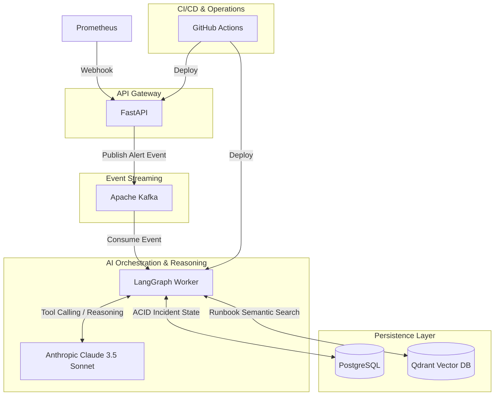

# AutoResolve Container Architecture Diagram (Level 2)

This diagram maps to the Level 2 Container Diagram established in
Architecture design, now populated with the precise technology
stack selected. It highlights the decoupled, scalable nature of
the deployable units within AutoResolve:
* The independent API Gateway (FastAPI) handling ingestion.
* The Event Streaming backbone (Apache Kafka) ensuring resilient,
  asynchronous hand-offs.
* The AI Orchestration & Reasoning layer, powered by LangGraph and
  Anthropic's Claude 3.5 Sonnet.
* The Persistence Layer distinctly split between transactional
  incident state (PostgreSQL) and semantic runbook search (Qdrant).
* The CI/CD & Operations boundary demonstrating automated deployment
  pipelines (GitHub Actions).

