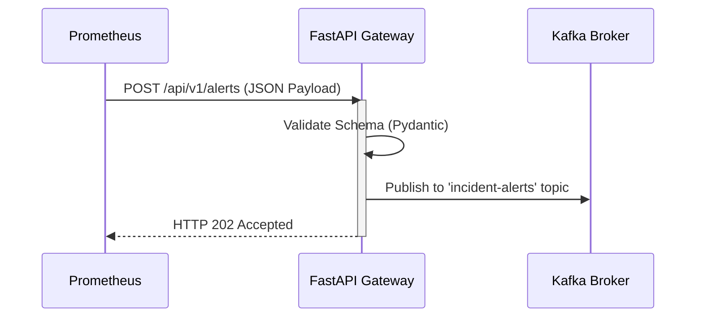

```mermaid
sequenceDiagram
    participant P as Prometheus
    participant API as FastAPI Gateway
    participant K as Kafka Broker
    
    P->>API: POST /api/v1/alerts (JSON Payload)
    activate API
    API->>API: Validate Schema (Pydantic)
    API->>K: Publish to 'incident-alerts' topic
    API-->>P: HTTP 202 Accepted
    deactivate API
```