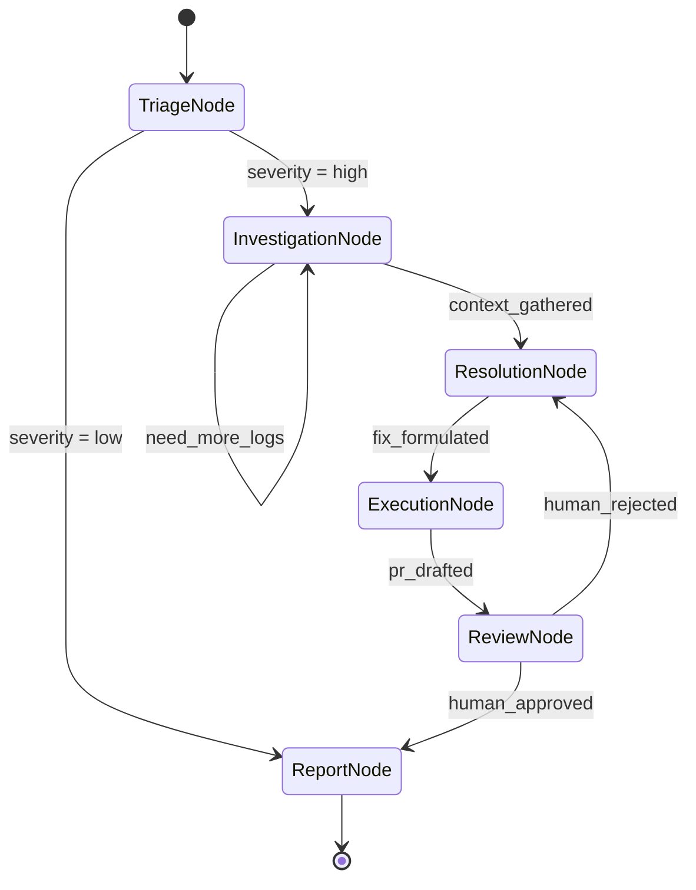

```mermaid
stateDiagram-v2
    [*] --> TriageNode
    TriageNode --> InvestigationNode: severity = high
    TriageNode --> ReportNode: severity = low
    
    InvestigationNode --> ResolutionNode: context_gathered
    InvestigationNode --> InvestigationNode: need_more_logs
    
    ResolutionNode --> ExecutionNode: fix_formulated
    ExecutionNode --> ReviewNode: pr_drafted
    
    ReviewNode --> ReportNode: human_approved
    ReviewNode --> ResolutionNode: human_rejected
    
    ReportNode --> [*]
```