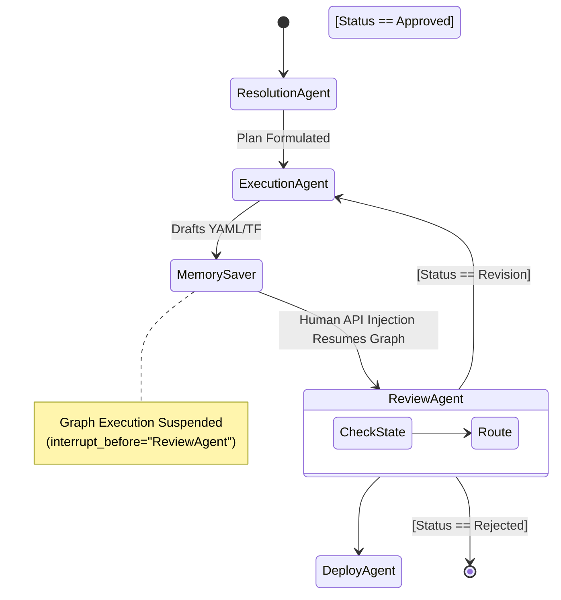

# Human-in-the-Loop (HITL) Workflow

This document illustrates the StateGraph execution flow containing the Execution Agent and the Review Agent boundary.

```mermaid
stateDiagram-v2
    [*] --> ResolutionAgent
    ResolutionAgent --> ExecutionAgent: Plan Formulated
    
    ExecutionAgent --> MemorySaver: Drafts YAML/TF
    note right of MemorySaver
      Graph Execution Suspended
      (interrupt_before="ReviewAgent")
    end note
    
    MemorySaver --> ReviewAgent: Human API Injection Resumes Graph
    
    state ReviewAgent {
        direction LR
        CheckState --> Route
    }
    
    ReviewAgent --> DeployAgent (MCP): [Status == Approved]
    ReviewAgent --> ExecutionAgent: [Status == Revision]
    ReviewAgent --> [*]: [Status == Rejected]
```