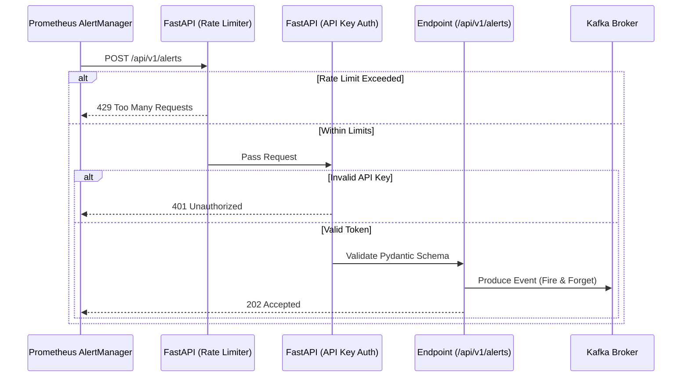

# API Gateway & Security Flow

This diagram illustrates the Phase 4 security posture for the FastAPI Ingestion Gateway, detailing the flow of incoming webhooks through the Rate Limiter and Authentication boundaries before reaching the Kafka Outbox.

