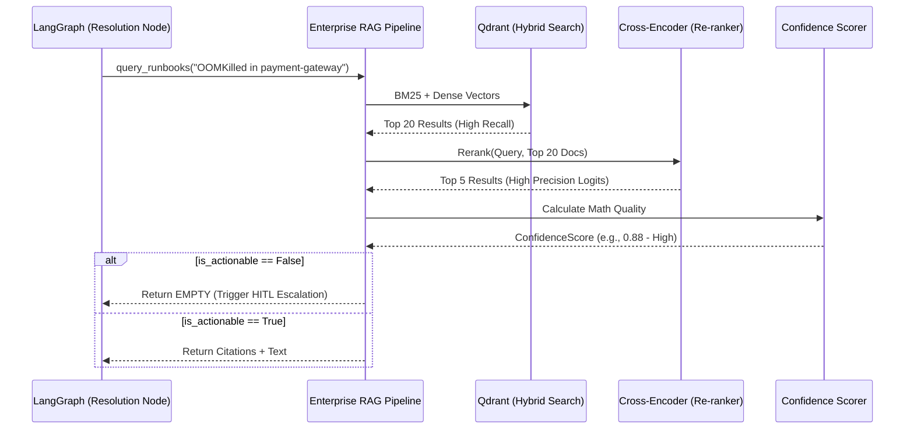

# Enterprise RAG & Confidence Workflow

```mermaid
sequenceDiagram
    participant LA as LangGraph (Resolution Node)
    participant Pipe as Enterprise RAG Pipeline
    participant Q as Qdrant (Hybrid Search)
    participant CE as Cross-Encoder (Re-ranker)
    participant Scorer as Confidence Scorer

    LA->>Pipe: query_runbooks("OOMKilled in payment-gateway")
    Pipe->>Q: BM25 + Dense Vectors
    Q-->>Pipe: Top 20 Results (High Recall)
    Pipe->>CE: Rerank(Query, Top 20 Docs)
    CE-->>Pipe: Top 5 Results (High Precision Logits)
    Pipe->>Scorer: Calculate Math Quality
    Scorer-->>Pipe: ConfidenceScore (e.g., 0.88 - High)
    
    alt is_actionable == False
        Pipe-->>LA: Return EMPTY (Trigger HITL Escalation)
    else is_actionable == True
        Pipe-->>LA: Return Citations + Text
    end
```