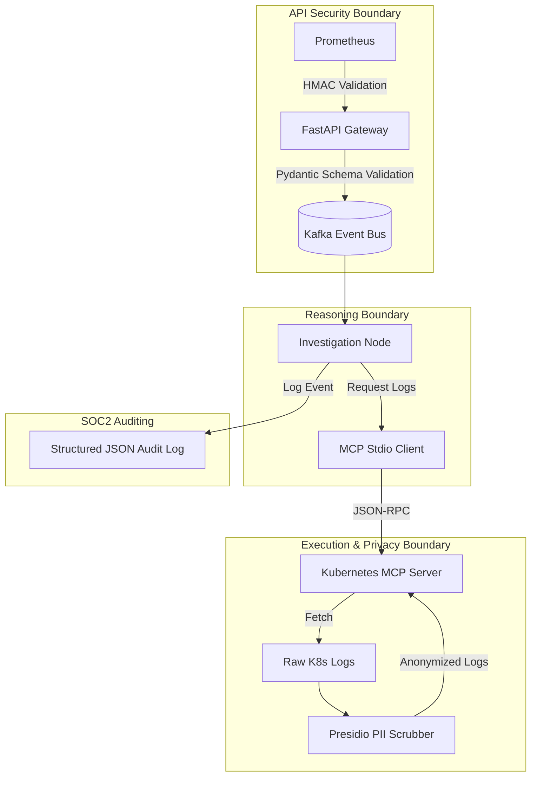

# Data Governance and Regulatory Compliance Architecture

# Ingestion Boundary (API Security & OWASP): The FastAPI gateway uses strict Pydantic
# models to drop malformed payloads and employs an HMAC/API-Key validation mechanism
# to prevent spoofed alerts from draining AI compute resources.
# Execution Boundary (MCP Security): The LLM operates in a sandboxed LangGraph state
# machine. It does not possess cluster credentials. It interacts with the cluster via
# the Model Context Protocol (MCP) using JSON-RPC over stdio. This creates an
# air-gapped security boundary with zero exposed network ports.
# Data Privacy Boundary (PII Scrubber): Before the Kubernetes MCP server returns log
# payloads to the LLM, we intercept the string and pass it through a Presidio-based
# PII Scrubber. This ensures SOC2 compliance by preventing accidental leakage of
# customer data to third-party LLM providers.
# Accountability Layer (Audit Logging): Every mutating action (e.g., drafting a PR,
# terraform plan) triggers a synchronous write to an Append-Only SOC2 Audit Logger.

