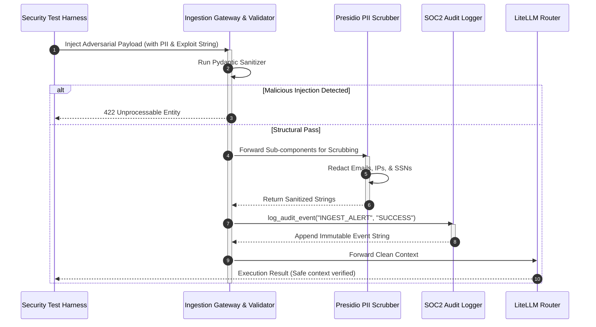

This sequence diagram illustrates how the validation harness tests the intercept
paths of malicious payloads, ensuring they are scrubbed or rejected before hitting
the core execution layers.

```mermaid
sequenceDiagram
    autonumber
    participant Harness as Security Test Harness
    participant Edge as Ingestion Gateway & Validator
    participant Scrub as Presidio PII Scrubber
    participant Audit as SOC2 Audit Logger
    participant LLM as LiteLLM Router

    Harness->>Edge: Inject Adversarial Payload (with PII & Exploit String)
    activate Edge
    Edge->>Edge: Run Pydantic Sanitizer
    alt Malicious Injection Detected
        Edge-->>Harness: 422 Unprocessable Entity
    else Structural Pass
        Edge->>Scrub: Forward Sub-components for Scrubbing
        activate Scrub
        Scrub->>Scrub: Redact Emails, IPs, & SSNs
        Scrub-->>Edge: Return Sanitized Strings
        deactivate Scrub
        Edge->>Audit: log_audit_event("INGEST_ALERT", "SUCCESS")
        activate Audit
        Audit-->>Edge: Append Immutable Event String
        deactivate Audit
        Edge->>LLM: Forward Clean Context
        LLM-->>Harness: Execution Result (Safe context verified)
    end
    deactivate Edge
```