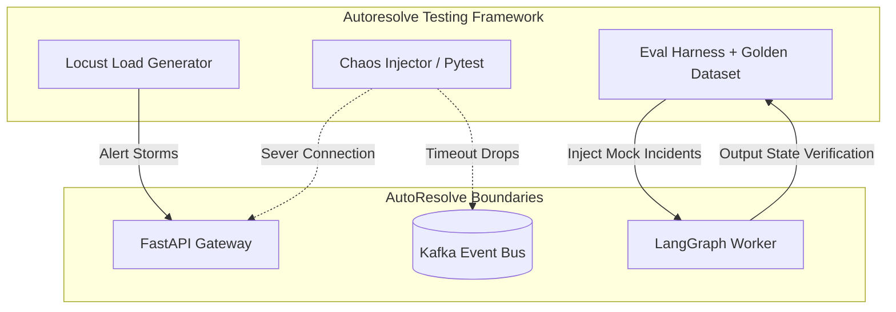

# Autoresolve Testing Framework

Framework to evaluate the system across three advanced testing dimensions:
* **Chaos Engineering:** The intentional injection of transient faults (e.g., Kafka broker
timeouts, database connection drops) to verify that the FastAPI gateway degrades
gracefully and the LangGraph state machine successfully utilizes its retry logic
without losing incident context.
* **Load Testing (Alert Storm Simulation):** Simulating cascading infrastructure failures
where Prometheus fires hundreds of concurrent alerts. This verifies the
FastAPI-to-Kafka ingestion boundary can queue high-throughput traffic without
dropping payloads or exhausting memory.
* **LLM Evaluation Framework:** "Vibes" are not a valid testing metric for AI. We
establish a "Golden Dataset" of historical mock incidents with known expected
outcomes. We quantitatively measure the Triage and Investigation agents against
this dataset to track accuracy, hallucination rates, and prompt regression.
